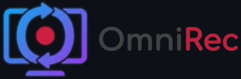
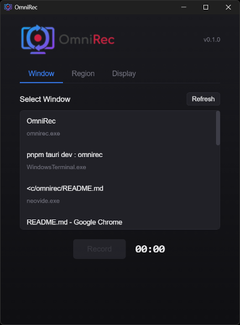

<picture>
  <source srcset="images/omnirec-banner-dark.png" media="(prefers-color-scheme: dark)">
  <source srcset="images/omnirec-banner-white.png" media="(prefers-color-scheme: light)">
  
</picture>

A high-performance screen, window, and region recording application built with Tauri. Record and share anything — completely free, no cloud account required.

---

> **Status**: Early Alpha — Windows fully supported, Linux/Wayland (Hyprland) in development. Core recording functionality works, but many planned features are not yet implemented.

## Current Features

- **Window Recording**: Capture any application window using Windows.Graphics.Capture API
- **Region Recording**: Select and record a custom region of your screen
- **MP4 Output**: H.264 encoded video via FFmpeg
- **High Performance**: Native Rust backend with efficient frame pipeline
- **No Cloud Required**: All processing happens locally — your recordings stay on your machine
- **Free & Open Source**: No subscriptions, no accounts, no limits



### Output

- **Format**: MP4 (H.264)
- **Frame Rate**: 30 fps (fixed)
- **Location**: User's Videos folder
- **Filename**: `recording_YYYY-MM-DD_HHMMSS.mp4`

### Planned Features

See [docs/requirements.md](docs/requirements.md) for the full roadmap, including:

- Full screen capture
- Pause/Resume recording
- Audio capture (system + microphone)
- Additional output formats (WebM, GIF, APNG, WebP)
- Configurable quality and frame rate
- Global hotkeys
- macOS and Linux support

## Tech Stack

- **Frontend**: Vanilla TypeScript, HTML, CSS
- **Backend**: Rust + Tauri v2
- **Capture**: [windows-capture](https://crates.io/crates/windows-capture) (Windows.Graphics.Capture API)
- **Encoding**: [ffmpeg-sidecar](https://crates.io/crates/ffmpeg-sidecar) (auto-downloads FFmpeg)
- **Build**: Vite

## Prerequisites

- [Node.js](https://nodejs.org/) (v18+)
- [pnpm](https://pnpm.io/)
- [Rust](https://www.rust-lang.org/tools/install)
- [Tauri Prerequisites](https://tauri.app/v2/start/prerequisites/) (Windows: WebView2, VS Build Tools)

### Linux/Wayland Additional Requirements

For Linux (Hyprland compositor only):

- Hyprland compositor
- xdg-desktop-portal
- PipeWire

## Development Setup

```bash
# Install dependencies
pnpm install

# Run in development mode
pnpm tauri dev

# Build for production
pnpm tauri build
```

## Linux Installation (Hyprland)

The Linux version requires a separate picker service that integrates with xdg-desktop-portal. This allows the app to capture screens without showing the default portal picker dialog.

### 1. Build the Picker Service

```bash
cd src-picker
cargo build --release
```

### 2. Install the Picker Binary

```bash
# System-wide (requires root)
sudo cp target/release/omnirec-picker /usr/local/bin/

# Or user-local
mkdir -p ~/.local/bin
cp target/release/omnirec-picker ~/.local/bin/
```

### 3. Install Portal Configuration

```bash
# Portal registration (requires root)
sudo cp resources/linux/omnirec.portal /usr/share/xdg-desktop-portal/portals/
```

### 4. Configure Portal Routing for Hyprland

```bash
mkdir -p ~/.config/xdg-desktop-portal
cp resources/linux/hyprland-portals.conf ~/.config/xdg-desktop-portal/
```

### 5. Install and Enable the Systemd Service

```bash
mkdir -p ~/.config/systemd/user
cp resources/linux/omnirec-picker.service ~/.config/systemd/user/

# If installed to ~/.local/bin, edit the service file:
# Change ExecStart=%h/.local/bin/omnirec-picker

systemctl --user daemon-reload
systemctl --user enable --now omnirec-picker
```

### 6. Restart xdg-desktop-portal

```bash
systemctl --user restart xdg-desktop-portal
```

### Verifying the Installation

Check that the picker service is running:

```bash
systemctl --user status omnirec-picker
```

Check that it registered on D-Bus:

```bash
busctl --user list | grep omnirec
```

### Troubleshooting

**Picker service won't start:**
- Check logs: `journalctl --user -u omnirec-picker -f`
- Ensure `HYPRLAND_INSTANCE_SIGNATURE` is set (only works under Hyprland)

**Portal still shows system picker:**
- Verify `hyprland-portals.conf` is in place
- Restart xdg-desktop-portal: `systemctl --user restart xdg-desktop-portal`
- Check portal config: `cat ~/.config/xdg-desktop-portal/hyprland-portals.conf`

**IPC connection failed:**
- Ensure the main app is running before initiating capture
- Check socket exists: `ls $XDG_RUNTIME_DIR/omnirec/`

## Recommended IDE Setup

- [VS Code](https://code.visualstudio.com/)
- [Tauri Extension](https://marketplace.visualstudio.com/items?itemName=tauri-apps.tauri-vscode)
- [rust-analyzer](https://marketplace.visualstudio.com/items?itemName=rust-lang.rust-analyzer)

## Project Structure

```
omnirec/
├── src/                    # Frontend TypeScript/HTML/CSS
│   ├── main.ts             # Main application logic
│   ├── selection-overlay.ts # Region selection UI
│   └── styles.css          # App styles (dark mode support)
├── src-tauri/              # Rust backend
│   └── src/
│       ├── lib.rs          # Tauri commands
│       ├── state.rs        # Recording state management
│       ├── capture/        # Window/region capture modules
│       │   ├── windows/    # Windows-specific capture
│       │   ├── linux/      # Linux/Wayland capture
│       │   └── macos/      # macOS capture (stub)
│       └── encoder/        # FFmpeg encoding
├── src-picker/             # Linux portal picker service
│   └── src/
│       ├── main.rs         # D-Bus service entry point
│       ├── portal_backend.rs # ScreenCast interface
│       └── ipc_client.rs   # IPC to main app
├── resources/
│   └── linux/              # Linux installation files
├── docs/                   # Documentation
│   └── requirements.md     # Full project requirements
├── openspec/               # Project specifications
└── package.json            # Node.js dependencies
```

## Documentation

- [Requirements](docs/requirements.md) - Full project requirements and specifications

## License

[MIT](LICENSE)
