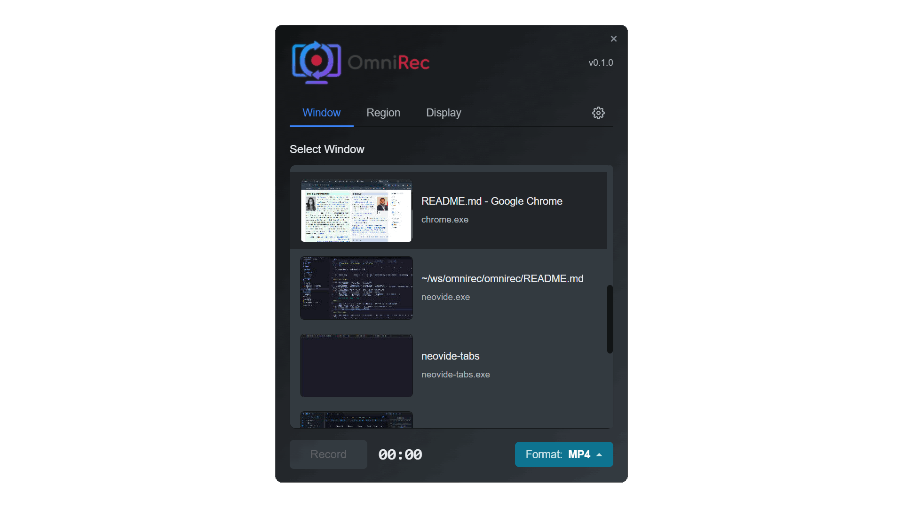

<p align="center">
    <picture>
      <!-- <source srcset="images/omnirec-banner-dark.png" media="(prefers-color-scheme: dark)"> -->
      <!-- <source srcset="images/omnirec-banner-white.png" media="(prefers-color-scheme: light)"> -->
      
    </picture>
</p>

<p align="center"><i>The universal screen recorder for every desktop</i></p>

<p align="center">
  <a href="https://github.com/omnirec/omnirec/actions/workflows/ci.yml"></a>
  <a href="https://github.com/omnirec/omnirec/actions/workflows/ci.yml"></a>
  <a href="https://github.com/omnirec/omnirec/releases"></a>
  <a href="https://github.com/omnirec/omnirec/blob/master/LICENSE"></a>
  <a href="https://aur.archlinux.org/packages/omnirec-bin"></a>
</p>

<picture></picture>

---

## Key Features

- **Universal Capture** — Record any window, entire display, or custom screen region
- **Audio Recording** — Capture system audio, microphone, or both with dual-source mixing
- **Echo Cancellation** — Built-in AEC removes speaker feedback when recording with a microphone
- **Multiple Formats** — Export to MP4, WebM, MKV, QuickTime, GIF, APNG, or WebP
- **Cross-Platform** — Works on Windows, macOS (12.3+), and Linux (Hyprland/Wayland)
- **Privacy-First** — All processing happens locally — your recordings never leave your machine
- **Free & Open Source** — No subscriptions, no accounts, no limits

## Coming Soon

- **Voice Transcription** — Streaming speech-to-text for automatic captions and searchable recordings
- **Global Hotkeys** — Start, stop, and pause recordings from anywhere with customizable shortcuts
- **Command Line Interface** — Scriptable recording for automation and power users

## Use Cases

| Use Case | Description |
|----------|-------------|
| **Record Meetings** | Capture video calls from Zoom, Teams, or Google Meet with system audio and microphone. Echo cancellation prevents feedback when using speakers. |
| **Create Tutorials** | Record step-by-step walkthroughs of software, websites, or workflows with voiceover narration. |
| **Capture Gameplay** | Record gaming sessions with system audio for sharing highlights or streaming clips. |
| **Bug Reporting** | Quickly capture and share screen recordings to demonstrate issues to developers or support teams. |

## Supported Platforms

| Platform | Version |
|----------|---------|
| Windows | 10, 11 |
| macOS | 12.3+ |
| Linux | Arch, Debian, Ubuntu, Fedora, and others |

**Linux Desktop Environments** (Wayland): Hyprland, GNOME, KDE

## Installation

> [!WARNING]
>
> OmniRec is in active development and is not yet available for general use. If you would like to help test OmniRec or contribute to its development, please download one of the available pre-release installation packages or build from source (see below).

### Windows

Download the latest `.msi` installer from the [Releases](https://github.com/omnirec/omnirec/releases) page.

### macOS

Download the latest `.dmg` from the [Releases](https://github.com/omnirec/omnirec/releases) page, open it, and drag OmniRec to your Applications folder.

### Linux (Arch/AUR)

> [!NOTE]
>
> Currently, **only** Arch Linux with Hyprland is supported (including Omarchy and other popular derivitives and configs). Support for other platforms and desktop environments is not yet available.

Use `makepkg`:

```bash
curl -LO https://github.com/omnirec/omnirec/releases/latest/download/PKGBUILD
curl -LO https://github.com/omnirec/omnirec/releases/latest/download/omnirec.desktop
makepkg -si
```

## Configuration & Permissions

OmniRec is designed to work with zero configuration, but it is necessary to grant it permission to record your screen. This process varies by OS and desktop environment:

### macOS

On first launch, grant Screen Recording permission in System Settings > Privacy & Security.

### Linux

On first recording request, OmniRec will display an approval dialog asking for permission to record the screen. You can check "Always allow OmniRec to record the screen" to bypass this dialog for future recordings.

The approval token is stored at `~/.local/state/omnirec/approval-token`. To revoke permission, delete this file.

## Development

### Prerequisites

- [Node.js](https://nodejs.org/) (LTS recommended)
- [pnpm](https://pnpm.io/) (optional)
- [Rust](https://rustup.rs/)
- [ImageMagick](https://imagemagick.org/script/download.php) (for icon generation)

### Build & Run

OmniRec is built with [Tauri](https://v2.tauri.app/). Use `npm` (or equivalent) to install and run the dev servver:

```
cd omnirec
npm install
npm run tauri dev
```

## License

[MIT](LICENSE)
